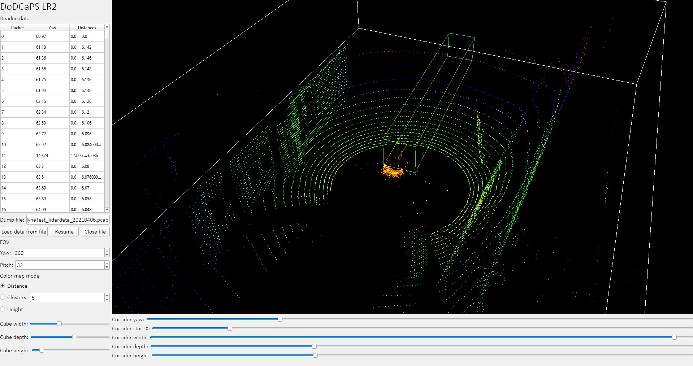

# Разработка систем сбора и обработки данных. Лабораторно-практическое задание № 2
## Python. Полностью свободное использование



### Задание:

```
Лабораторно-практическое задание № 2
Тема: Обработка структурированных пространственных данных и отслеживание
объектов.
Цель работы: Разработать алгоритм считывания и визуализации потоковых данных в
виде динамически обновляемого облака точек многолучевого 3D-лидара
Задачи:
 Подготовить приложение считывания данных с 3D-лидара, сохраненных в файле
потоковом формате и вычисления облака точек;
 Разработать функцию динамического обновления данных в заданной структуре
(объекте) для хранения данных облака точек;
 Разработать функцию покадровой визуализации облака точек в изометрической
проекции и в режиме «вид сверху» с заданным (настраиваемым) фреймрейтом
(частотой);
 Разработать функцию фильтрации данных с использованием плоскостей отсечения
(куб интереса);
 Разработать функцию детектирования объектов методом кластерного анализа;
 Разработать метод отслеживания «коридора проходимости» для прямолинейного
движения.
Порядок выполнения работы
Задача 1
Подготовить приложение для считывания данных из файла, хранящего поток данных с
3D-лидара (Velodyne lidar). Реализовать возможность определения скорости считывания
данных (настраиваемая пауза между считыванием байтовых блоков фиксированного
размера).
Представить возможность просмотра данных в текстовом виде в непрерывном потоке.
Реализовать алгоритм разбора потока данных и вычисления параметров точек (в
декартовой системе координат).
Задача 2
Подготовить систему хранения текущих данных «окружающего» облака точек. При
обновлении данных учитывать идентификатор луча и азимут (угол поворота)
сканирующей головки лидара. Рекомендуется применить структуру из 360 (округленный
угол) на 32 (количество лучей) ячеек. Реализовать возможность настройки углов (сектора)
в котором данные обновляются и по горизонтали, и по вертикали.
Задача 3
2
Разработать функцию отрисовки облака точек в изометрической проекции и в режиме
«вид сверху» с использованием хранящихся координат. Обеспечить настройку позиции
лидара в проекции и масштабного коэффициента, а также реализовать автоматическую
перерисовку изображения с настраиваемым интервалом (рекомендуемые периоды от 1/10
до 2 сек). В любой проекции применять изменение цвета (яркости) точек как способ
отображения удаленности точек от наблюдателя (от 128-максимально удалено, до 256 –
максимально близко).
Задача 4
Опираясь на реализованный метод хранения координат точек из окружающего облака
точек разработать функцию отсечения области отображаемых точек шестью плоскостями,
параллельными плоскостям декартовой системы координат.
Задача 5
Разработать функцию поиска центров масс кластеров методом k-means и расчета веса,
радиуса и плотности кластеров. Реализовать раскрашивание кластеров для их визуальной
идентификации. Реализовать возможность задания критериев интерпретации кластера как
объекта через указанные параметры. Выполнить обводку параллелепипедами найденных
объектов.
Задача 6
Разработать функцию расчета глубины коридора проходимости, путем задания
позиции, ширины и высоты коридора, с последующим поиском длины (глубины) путем
анализа коллизий с найденными окружающими объектами. Реализовать отображение
коридора в режиме «вид сверху», а также как передней и задней плоскостей на
изометрической проекции.
Задача 7 (Дополнительно)
Реализовать получение данных с реального устройства по протоколу UDP.
Приложение
Параметры файла потока данных с лидара
Файл хранит «сырые» данные, поступившие с устройства (pcap), закодированные
методом bin2hex. Для удобства просмотра данных в поток добавлены символы конца
строки (\n), которые не нужно интерпретировать.
Параметры подключения реального устройства (Velodyne HDL-32E)
Устройство рассылает данные в своём сегменте локальной сети методом
широковещательной рассылки по протоколу UDP в виде непрерывного потока бинарных
данных. Для получения данных необходимо открыть слушающий UDP-сокет на порту
2368. Несмотря на то, что это не указано явно, приходящие пакеты обычно содержат
полноценный набор данных одного изменения или кратное количество записей измерений
с разных азимутов. Не гарантируется последовательный обход (сканирование) всех 
3
азимутов, возможны пропуски некоторых значений при проведении измерений.
```
